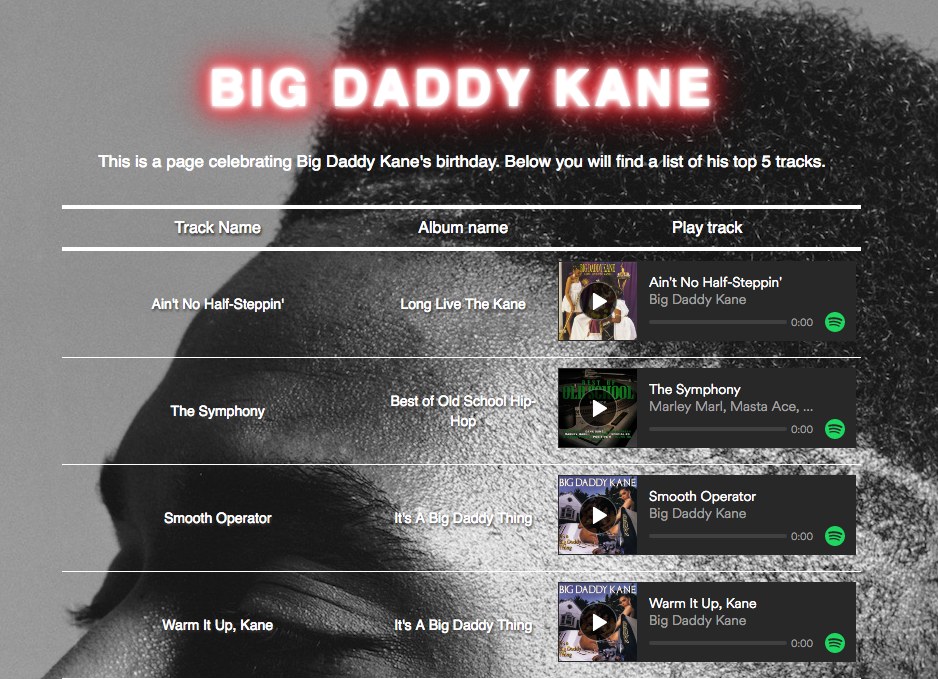
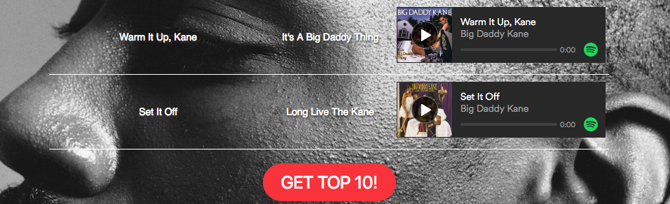
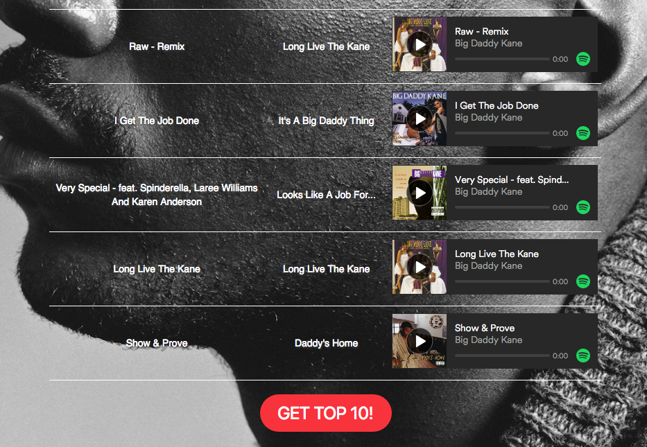

# Big Daddy Kane

*   Version: 1.0

## Description

A single html webpage, built to celebrate the birthday of Big Daddy Kane. Built using the [Spotify API](https://developer.spotify.com/web-api/) it shows the top 5 most popular tracks played through Spotify for the artist Big Daddy Kane. Please note, there is no server in this app.

## Installation

1. Clone this repo.
2. Open index.html in the browser.

## Using Big Daddy Kane

Open index.html in the browser.

The landing page shows the top 5 tracks as ranked by the spotify app, and includes a Spotify player containing that track which will render upon the page loading. The user can click on the play button to hear the track.

To retrieve the next five tracks, click on the button at the bottom of the page:

Upon clicking, the page will extend to show the next five most popular tracks from the artist.

Please note, if the user does not have a Spotify account, they will be redirected to a sign-up. Alternatively, without signing-up, they may listen to a 30 second preview of the track.
